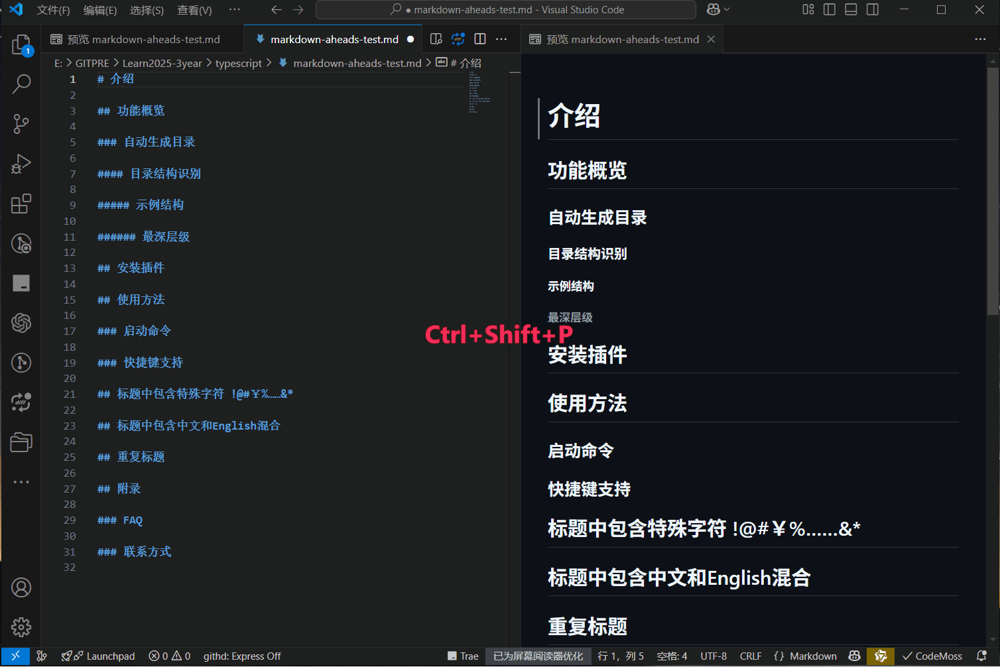
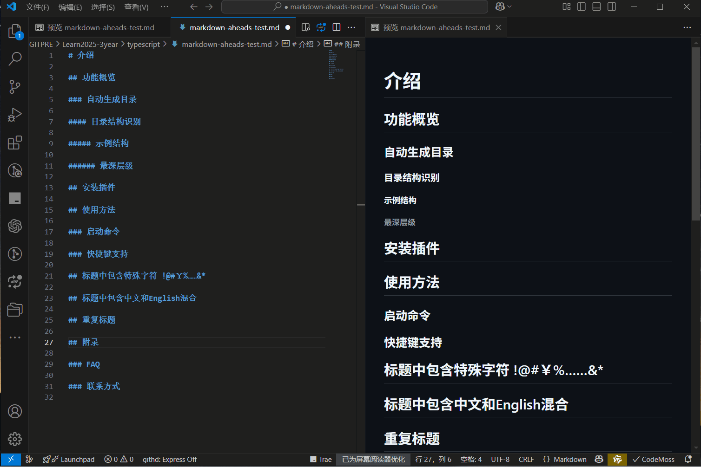
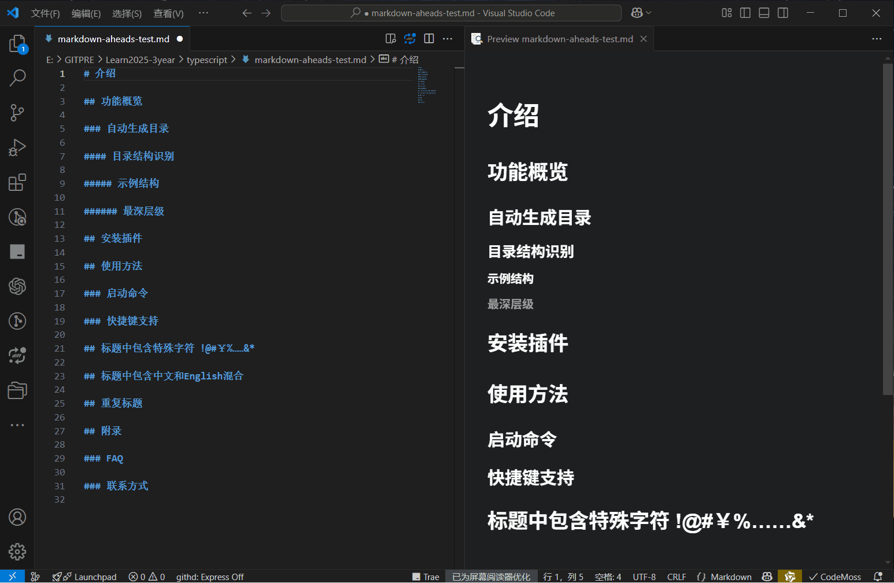
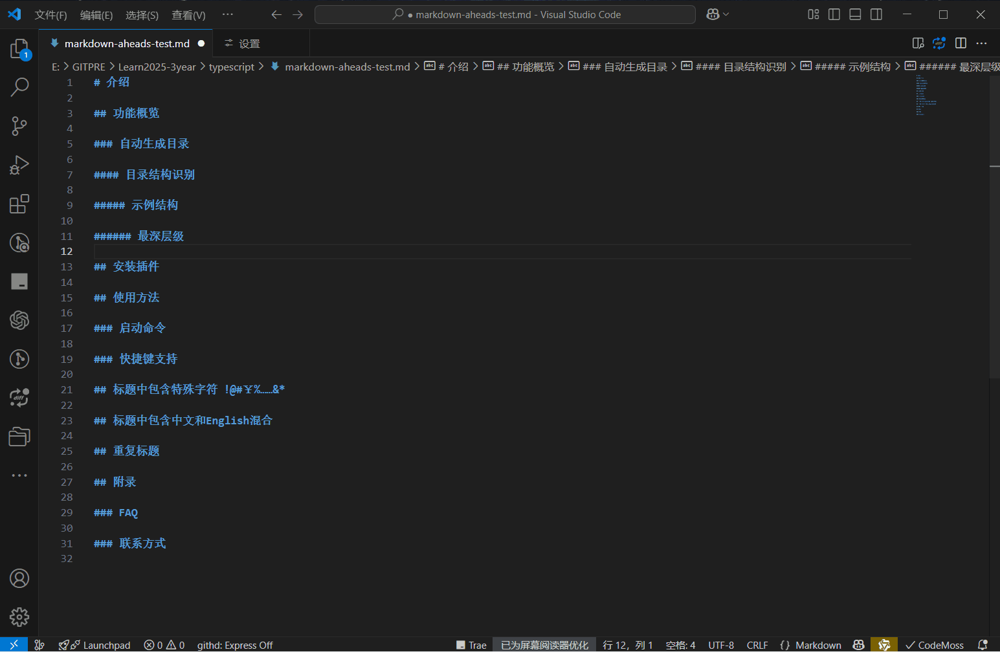
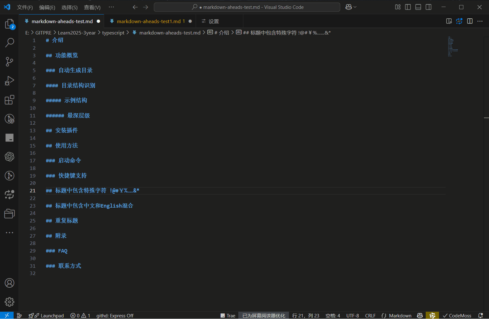

# markdown aheads README

markdown标题与目录处理插件。

使用方法：在vscode中 ctrl+shift+p 输入 AHeads 选择功能。

包含以下功能：

"AHeads:AddIndex": "添加标题序号"

"AHeads:RemoveIndex": "移除标题序号"

"AHeads:TitleUpgrade": "标题升级"
当前标题及其子标题，都会提升一级。

"AHeads:TitleDowngrade": "标题降级"
当前标题及其子标题，都会降低一级。

"AHeads:TableOfContentsCreate": "创建目录"

"AHeads:TableOfContentsUpdate": "更新目录"

"AHeads.TableOfContentsDelete": "删除目录"

两个配置项：

"Starting Level Of Serial Number(1-5)": "序号起始标题级别(1-5)"

"Title Start Identification(single character)": "标题起始标识(单个字符)"

